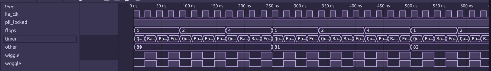

# Getting Started

Now that you've [installed] Torii ILA, you're all ready to start using it, or if you rather just want something to copy paste, you can find that in the [TL;DR](#tldr) at the end.

This section of the docs will walk you through a very simple initial setup by using one of the [examples] that are provided.

This guide will cover the USB ILA example [`bitsy_usb_ila.py`], but we'll have the small changes in the UART example at the end.

## Example Prerequisites

There are a few extra prerequisites needed, in this case you need a [iCEBreaker Bitsy] from [1BitSquared] and to have [Torii Boards] installed.

It is also expected you have a VCD viewer installed, such as [Surfer] or [gtkwave].

## Example: USB Integrated Logic Analyzer

Now, with all of the prerequisites sorted, lets guide you through the example and how to set up a [USB] based Torii ILA.

### Gateware

First up is the actual gateware that will be run on the device, it's the example ILA along with some example signals and support bits.

#### PLL Module

The first big chunk is the PLL elaboratable, this is platform specific, but it shows how to set up an ICE40UP5K PLL for use as a USB device with [Torii-USB].

```{eval-rst}
.. literalinclude:: ../examples/bitsy_usb_ila.py
   :linenos:
   :lineno-match:
   :lines: 42-94
```

The big thing to note here, as we will need it later, is the resulting frequency of the `sync` domain, which in this case is `48e6Hz` or `48MHz`.

#### Top Module

Next up is the main elaboratable module we will be synthesizing, in this case called `Top`. We set up a few example signals for us to capture on the FPGA so we can be sure that the ILA is doing something.

```{eval-rst}
.. literalinclude:: ../examples/bitsy_usb_ila.py
   :linenos:
   :lineno-match:
   :lines: 102-109
```

The `timer` signal has an enum based decoder attached to it, this helps us show that the resulting VCD from the ILA retains signal decoders and emits them properly in the trace, it looks as follows:

```{eval-rst}
.. literalinclude:: ../examples/bitsy_usb_ila.py
   :linenos:
   :lineno-match:
   :lines: 96-100
```

Last thing in the constructor is the actual creation of the {py:class}`USBIntegratedLogicAnalyzer <torii_ila.usb.USBIntegratedLogicAnalyzer>` itself, we give it all the signals we want to keep track of, how deep we want our sample memory, as well as the sample rate which we got from the PLL config and the USB resource name for it to use.

```{eval-rst}
.. literalinclude:: ../examples/bitsy_usb_ila.py
   :linenos:
   :lineno-match:
   :lines: 112-126
```

Now we move on to the `elaborate` method, most of the stuff in here is just to support the example, but here we also ensure the ILA is a submodule, and also show an example of adding "private" signals to the ILA for capture.

Adding the ILA as a submodule is typical to torii:

```{eval-rst}
.. literalinclude:: ../examples/bitsy_usb_ila.py
   :linenos:
   :lineno-match:
   :lines: 139
```

The important thing in here is just below that, it's where we create two module internal signals, and add them to the ILA for capture.

```{eval-rst}
.. literalinclude:: ../examples/bitsy_usb_ila.py
   :linenos:
   :lineno-match:
   :lines: 141-146
```

Along with {py:meth}`append_signals <torii_ila.ila.IntegratedLogicAnalyzer.append_signals>` there is also an {py:meth}`add_signal <torii_ila.ila.IntegratedLogicAnalyzer.add_signal>` that lets you add a single {py:class}`Signal <torii.hdl.ast.Signal>` at a time rather than an iterable of them.

The remainder of the logic in `elaborate` is simply just driving the example signals:

```{eval-rst}
.. literalinclude:: ../examples/bitsy_usb_ila.py
   :linenos:
   :lineno-match:
   :lines: 148-174
```

### Building and Backhaul

Now that we have been aquatinted with the [gateware](#gateware), we can move on to the more exciting bits, actually building it, loading it onto a device, and getting real ILA samples back.

#### Platform Setup and Building

The first handful of lines after `main()` are just setup, we create an instance of our `Top` module, set the VCD destination file name, and create the platform for the [iCEBreaker Bitsy] that we are targeting.

```{eval-rst}
.. literalinclude:: ../examples/bitsy_usb_ila.py
   :linenos:
   :lineno-match:
   :lines: 192-194
```

After that is the actual gateware synthesis and upload, we simply call `plat.build` with a handful of arguments to get everything handled for us.

```{eval-rst}
.. literalinclude:: ../examples/bitsy_usb_ila.py
   :linenos:
   :lineno-match:
   :lines: 197-208
```

Some of these options need explaining, the `name`, and `do_program` are self explanatory, but the last three are a bit more archaic.

The `script_after_read` option is a string that is a Yosys command that is added to the synthesis script right after the design source is read in, this is prior to synthesis actually being executed. What this line is doing, is making `abc9` run twice, to try to better optimize the design. This is used in conjunction with the `synth_opts` option of `-abc9`, which tells Yosys when synthesizing the design to use abc9.

The `nextpnr_opts` is simply passing a PNR seed that was found to work for this design, depending on nextpnr internal changes, the phase of the moon, or how grumpy your cat is that day, you might need to adjust this to make sure timings pass.

This whole thing is wrapped in a `try`/`except` because the {py:class}`USBIntegratedLogicAnalyzer <torii_ila.usb.USBIntegratedLogicAnalyzer>` does not set up a fully DFU compliant device, so when `dfu-util` sees the device come back and it is missing the DFU endpoint it gets cranky, but that's okay.

#### Backhaul and Data Exfiltration

Now that all the gateware specific details have been dealt with, we can get data off the device! Exciting!

The first little bit just prints out the ILA configuration information for us, it's not too important, the main focus here is getting our hands on a {py:class}`USBIntegratedLogicAnalyzerBackhaul <torii_ila.usb.USBIntegratedLogicAnalyzerBackhaul>` interface.

That is a lot more straightforward than it seems:

```{eval-rst}
.. literalinclude:: ../examples/bitsy_usb_ila.py
   :linenos:
   :lineno-match:
   :lines: 217
```

See? It's that easy!

You can actually do it two ways, the first being getting it from the ILA instance from the gateware, that is what is done above, and it has the advantage of just giving you a fully set up backhaul interface.

The other way is to manually construct a {py:class}`USBIntegratedLogicAnalyzerBackhaul <torii_ila.usb.USBIntegratedLogicAnalyzerBackhaul>` and pass the ILA instance into it, so it can read the information it needs.

In the case of the USB ILA, the VID/PID are fixed, and the backhaul interface looks for them by default.

Next, we dump the decoded samples to `stdout`, this has a whole lot of machinery working behind the scenes to give us a simple signal name:value dictionary out from the USB device.

```{eval-rst}
.. literalinclude:: ../examples/bitsy_usb_ila.py
   :linenos:
   :lineno-match:
   :lines: 219-222
```

After we list out the collected samples to `stdout`, we then write a VCD file:

```{eval-rst}
.. literalinclude:: ../examples/bitsy_usb_ila.py
   :linenos:
   :lineno-match:
   :lines: 224
```

### Running the Example

Now we're ready to run!

Hold down the button on the bitsy next to the USB port while you plug it in, this will cause it to boot into bootloader mode. This will be indicated by a flashing blue on the RGB LED.

Running `lsusb -d 1d50:6146` should show the `OpenMoko, Inc. iCEBreaker bitsy v1.x (DFU)` device.

Next, simply run `python bitsy_usb_ila.py`, you should see it say `Building gateware...` followed by a bit of a delay. After that `dfu-util` should show that it is programming the device.

After another short delay of the device coming back, you should see the following output:

```console
ILA Info:
  bytes per sample: 2
  bits per sample:  16
  sample rate:      48.0 MHz
  sample period:    20.833333333333332 ns
Collecting ILA Samples
0.00 ns:
  pll_locked: 1
  timer: 11
  flops: 001
  other: 10000000
  wiggle: 0
  woggle: 0

-- SNIP --

Writing to VCD: /path/to/bitsy_usb_ila.vcd
```

With that you should now have a VCD to load and look at, feel free to poke around, but it should look something like the following:



```{note}
Hot tip, you can use the web version of Surfer at https://app.surfer-project.org/ to load the VCD in your web browser
```

You may have noticed the `ila_clk` signal in the list and wonder where it came from. It's a synthetic signal that is generated using the sample rate you gave the ILA. It is effectively the sample clock used in the ILA, but is not a direct capture of it.

### Conclusion and UART Notes

And with that, you're done! You're all ready to go and use Torii ILA in your projects.

The [UART] ILA is much the same, the interface for everything is basically identical except in two spots. The first being in the actual construction of the ILA module itself:

```{eval-rst}
.. literalinclude:: ../examples/bitsy_uart_ila.py
   :linenos:
   :lineno-match:
   :lines: 111-115
```

It has 3 extra kwargs, the first being `divisor`, this is the divisor used to drive the UART to reach the requested baud on the output clock domain, it should be `int(clk_speed // baud)`. The next two are `tx` and `rx`, these are the signals that should be tied to the boards UART transmit and receive pins.

The second difference is in the backhaul interface:

```{eval-rst}
.. literalinclude:: ../examples/bitsy_uart_ila.py
   :linenos:
   :lineno-match:
   :lines: 231-234
```

The UART backhaul specifically wants a pre-configured [pyserial] {py:class}`Serial <serial.Serial>` object due to the nature of the interface.

Other than that, the rest of the API is identical.


## TL;DR

If you really just need something to drop in,

```{eval-rst}
.. tab:: USB

	.. code-block:: python
	   :linenos:

		# In your imports section
		from torii_ila import USBIntegratedLogicAnalyzer

		# ...

		# In your Torii Elaboratable `__init__`
		self.ila = USBIntegratedLogicAnalyzer(
			# The initial set of signals we care about
			signals = [
				# List of Signals
			],
			# How many samples we want to capture
			sample_depth = 32,
			# How fast our sample domain is, in this case `sync`
			sample_rate  = 48e6,
			# The name of the USB resource to pull from the platform.
			bus = 'usb',
		)

		# ...

		# In the def elaborate() method

		m.submodules.ila = self.ila

		# Wherever you need to get the backhaul interface

		backhaul = top.ila.get_backhaul()
		backhaul.write_vcd(vcd_file)

.. tab:: UART

	.. code-block:: python
	   :linenos:

		# In your imports section
		from torii_ila import UARTIntegratedLogicAnalyzer

		# ...

		# In your Torii Elaboratable `__init__`
		self.ila = UARTIntegratedLogicAnalyzer(
			# UART Divisor (clk // baud)
			divisor = int(48e6 // SERIAL_PORT_BAUD),
			# UART IO
			tx = self.tx, rx = self.rx,
			# The initial set of signals we care about
			signals = [
				# List of Signals
			],
			# How many samples we want to capture
			sample_depth = 32,
			# How fast our sample domain is, in this case `sync`
			sample_rate  = 48e6
		)

		# ...

		# In the def elaborate() method

		m.submodules.ila = self.ila

		# Wherever you need to get the backhaul interface
		backhaul = top.ila.get_backhaul(serialport)
		backhaul.write_vcd(vcd_file)

```

[examples]: https://github.com/shrine-maiden-heavy-industries/torii-ila/blob/main/examples
[`bitsy_usb_ila.py`]: https://github.com/shrine-maiden-heavy-industries/torii-ila/blob/main/examples/bitsy_usb_ila.py
[iCEBreaker Bitsy]: https://1bitsquared.com/products/icebreaker-bitsy
[1BitSquared]: https://1bitsquared.com/
[Torii Boards]: https://torii-boards.shmdn.link/
[Surfer]: https://surfer-project.org/
[gtkwave]: https://gtkwave.github.io/gtkwave/
[Torii-USB]: https://github.com/shrine-maiden-heavy-industries/torii-usb
[USB]: ./ila/usb.md
[UART]: ./ila/uart.md
[pyserial]: https://github.com/pyserial/pyserial
